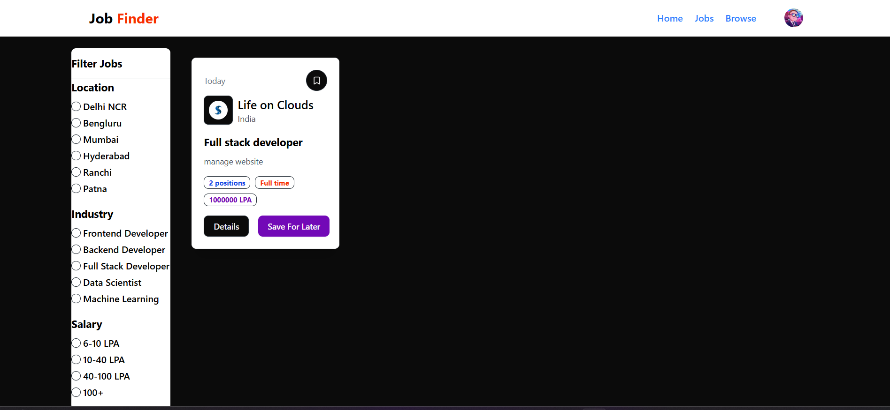
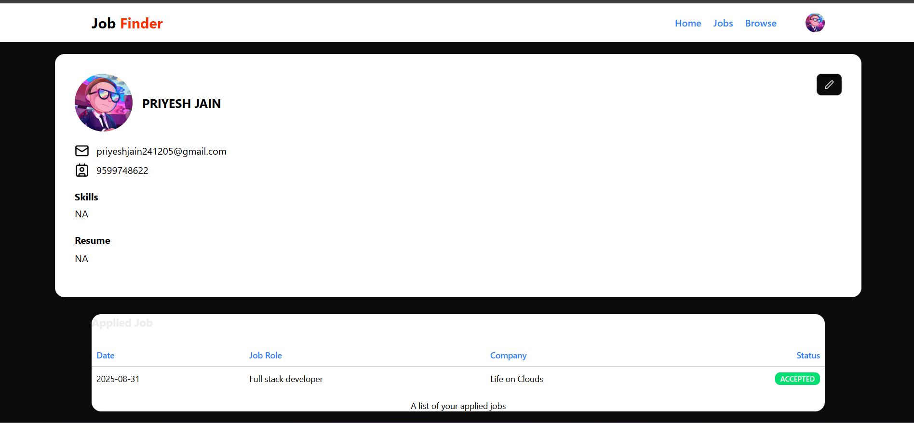
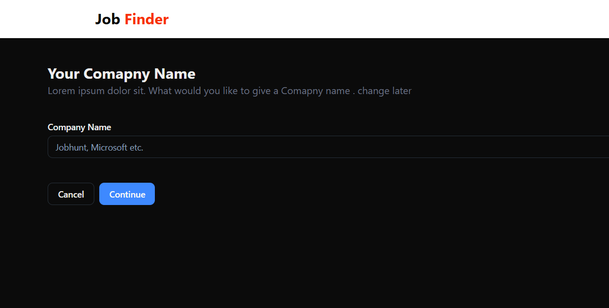

💼 Job Portal

A full-stack Job Portal web application built with React (frontend) and Node.js + Express (backend).
It allows companies to post jobs and candidates to browse, search, and apply for jobs.

🚀 Features
👨‍💼 For Job Seekers

Browse available jobs
Search & filter jobs by title, company, or location
Save jobs for later
View detailed job descriptions

🏢 For Companies (Admin)

Add, edit, and delete jobs
Manage company profiles
Track applications from candidates

⚙️ General

Modern, responsive UI with Tailwind CSS + ShadCN UI
Role-based views for Admins and Users
Interactive job cards with smooth hover effects
Real-time application status (pending, accepted, rejected)

🛠️ Tech Stack

Frontend:

• React.js

• React Router

• Tailwind CSS

• ShadCN UI Components

Backend:
• Node.js

• Express.js

• MongoDB (Mongoose ODM)

Other Tools:
• Git & GitHub for version control

• Vite (if you used it for React)

1️⃣ Clone the repository

git clone https://github.com/Priyesh-Jain24/job-portal.git

cd job-portal

2️⃣ Setup backend

cd server

npm install

npm start

3️⃣ Setup frontend

cd ../client

npm install

npm run dev

### Homepage

### Dashboard

### Profile

### Recruiter

